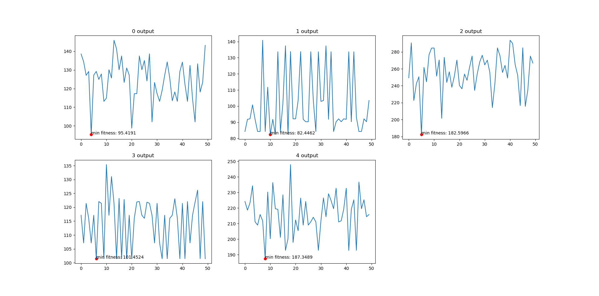

# 👨‍💼Travel Salesman Problem (TSP) with limitaion 

## TSP definition
The Traveling Salesman Problem (TSP) is a classic combinatorial optimization problem in the field of computer science and operations research. The problem involves finding the shortest possible route that visits a set of given cities and returns to the original city, while visiting each city exactly once and minimizing the total distance traveled. Mathematically, it can be formulated as follows:

Given a list of cities and the distances between each pair of cities, the objective is to find the shortest possible tour that visits each city exactly once and returns to the original city. The problem is typically stated as an optimization problem, seeking to minimize the total distance traveled.

The Traveling Salesman Problem is known to be NP-hard, meaning that no efficient algorithm is currently known that can solve all instances of the problem in polynomial time. However, there are various approximate algorithms, heuristics, and exact algorithms that can be used to find near-optimal solutions for many instances of the problem. The TSP has applications in a wide range of fields, including logistics, transportation, network design, and manufacturing.

 By <a href="//commons.wikimedia.org/w/index.php?title=User:Saurabh.harsh&amp;action=edit&amp;redlink=1" class="new" title="User:Saurabh.harsh (page does not exist)">Saurabh.harsh</a> - Own work, <a href="https://creativecommons.org/licenses/by-sa/3.0" title="Creative Commons Attribution-Share Alike 3.0">CC BY-SA 3.0</a>, <a href="https://commons.wikimedia.org/w/index.php?curid=23385823">Link</a>

## Goal of this study
Dealing with TSP with below conditions:
1. Create 5 routes that all conclude at Ming's residence.
2. Each route carries a specific weight at each node, and if the cumulative weight exceeds 100, an immediate return to Ming's home is required.
3. The primary objective is to minimize the overall distance traveled.
   
## Flow chart

## Output

